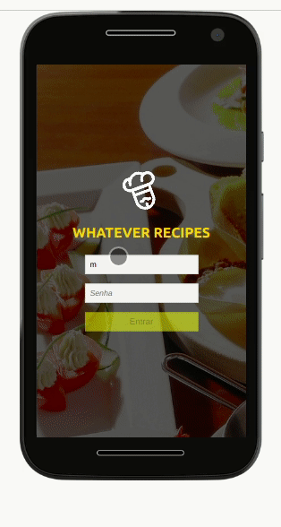

# recipe-app

<a href="#portuguese">Portuguese README</a><br/>
<a href="#english">English README</a><br/>

# Portuguese
## Descrição do Projeto

<p>Um app de receitas (feito pensado para mobile) onde o usuário pode interagir e aplicar diferentes tipos de buscas e filtros. Projeto foi feito em grupo.</p>
<h1 align="center"> <br/> <a href="https://juliana-happatsch.github.io/recipes-app/">🔗 Link do projeto</a>  </h1>  <p align="center">🚀 #VQV</p>


# Sumário
<p align="center">  <a href="#objetivos">Objetivos</a> •  <a href="#tecnologias">Tecnologias</a>  • <a href="#desenvolvedores">Desenvolvedores</a>  </p>
<br/>

## Demonstração da aplicação



## Objetivos
Esse projeto foi desenvolvido visando desenvolver um app de receitas, utilizando duas ferramentas dentro do ecossistema React: Hooks e Redux! Nesse app é possível ver, buscar, filtrar, favoritar e acompanhar o processo de preparação de receitas e drinks!

Foram utilizadas 2 APIs distintas como base de dados, linkadas abaixo, uma para comidas e outra para bebidas.

- <a href="https://www.themealdb.com/api.php">Comidas</a>
-  <a href="https://www.thecocktaildb.com/api.php">Bebidas</a>

O layout tem como foco dispositivos móveis.


## Tecnologias

- <a href="https://pt-br.reactjs.org/docs/getting-started.html">React</a>
- Hooks
- <a href="https://react-redux.js.org/">Redux</a>
- <a href="https://reactrouter.com/web/guides/quick-start">React-router-dom</a>
- Css

<br/>

### Habilidades

-   Utilizar Redux para gerenciar estado
-   Utilizar a biblioteca React-Redux
-   Utilizar o React Hook useState
-   Utilizar o React Hook useContext
-   Utilizar o React Hook useEffect
-   Criar Hooks customizados
-   Guardar informações no localStorage
-   Aprimorar as softskills desenvolvendo o projeto em grupo

<br/>
<br/>

##  Pré-requisitos e como rodar a aplicação

Antes de começar, você vai precisar ter instalado em sua máquina as seguintes ferramentas:  
[Git](https://git-scm.com/), [Node.js](https://nodejs.org/en/).  
Além disto é bom ter um editor para trabalhar com o código como [VSCode](https://code.visualstudio.com/)

Clone o repositório
Após clonar o repositório é necessário rodar o seguinte comando via terminal para baixar suas dependências:
> ``` npm install ```

E para inicializar a aplicação rode o comando
> ``` npm start ```

<br/>

## Desenvolvedores

<a href="https://github.com/albertoscandido">**Alberto Candido**</a><br/>
<a href="https://github.com/juliana-happatsch">**Juliana Happatsch**</a><br/>
<a href="https://github.com/marialisboa600">**Maria Lisboa**</a><br/>
<a href="https://github.com/vitor-m-cardoso">**Vitor Cardoso**</a>

---
<br/>

# English
## Project's description

A recipes app (made for mobile) where the user can interact and apply differents types of searches and filters. The project was made in group.

<h1 align="center"> <br/> <a href="https://juliana-happatsch.github.io/recipes-app/">🔗 Link to the project</a>  </h1>  <p align="center">🚀 #VQV</p>

# Summary
<center><a href="#goals">Goals</a> • <a href="#technologies">Technologies</a> • <a href="#developers">Developers</a></center>
<br/>

## App demo


## Goals
The goal while doing this project was to create a recipes app that was possible to look for, search, filter, favorite, and to keep up with the process in the making of the recipes! You can find foods and drinks in here.
This project was made using two tools inside the React ecossystem: Hooks and Redux! In this app, it's 

It were used 2 APIs (linked down below) for the data base, one for the foods and another for the drinks.

- <a href="https://www.themealdb.com/api.php">Food</a>
- <a href="https://www.thecocktaildb.com/api.php">Drink</a>

The layout had a mobile devices focus.

## Technologies

- <a href="https://pt-br.reactjs.org/docs/getting-started.html">React</a>
- Hooks
- <a href="https://react-redux.js.org/">Redux</a>
- <a href="https://reactrouter.com/web/guides/quick-start">React-router-dom</a>
- Css
<br/>

### Habilities

- Use Redux to manage the state
- Use the React-Redux library
- Use the useState React Hook
- Use the useContext React Hook
- Use the useEffect React Hook
- Create custom Hooks
- Manipulate infos in the localStorage
- Improve the soft skills working as a team

<br/>
<br/>

## Developers

<a href="https://github.com/albertoscandido">**Alberto Candido**</a><br/>
<a href="https://github.com/juliana-happatsch">**Juliana Happatsch**</a><br/>
<a href="https://github.com/marialisboa600">**Maria Lisboa**</a><br/>
<a href="https://github.com/vitor-m-cardoso">**Vitor Cardoso**</a>